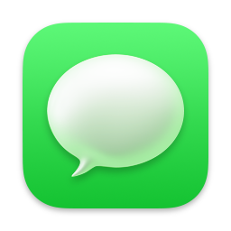
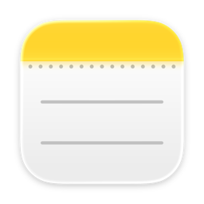

# Apple Apps MCP Plugins for Codex

Use Apple Mail, Apple Reminders, Apple Calendar, Apple Messages, and Apple
Notes from local Codex plugins on macOS.

Add this repository as a Codex plugin marketplace, then install the Apple app
plugins you want. Each plugin talks to the Apple app already on your Mac.

<p align="center">
  
  &nbsp;&nbsp;&nbsp;
  
  &nbsp;&nbsp;&nbsp;
  
  &nbsp;&nbsp;&nbsp;
  
  &nbsp;&nbsp;&nbsp;
  
</p>

<p align="center">
  <strong>Mail</strong> · <strong>Reminders</strong> · <strong>Calendar</strong> · <strong>Messages</strong> · <strong>Notes</strong><br />
  <sub>Find mail, manage tasks, work with events, search messages, and write notes.</sub>
</p>

## What You Can Do

- Ask what is new in Mail, find messages by topic, draft replies, and move
  messages when you confirm.
- Check upcoming Calendar events, search old meetings, open events in
  Calendar.app, and create or update events with a preview first.
- Find the next Reminders item, search lists, create tasks, mark them done, and
  move them between lists.
- Fetch unread Messages, search local iMessage/SMS history, and send messages
  only after confirmation.
- Search Notes, read selected notes, create new notes, append to existing ones,
  and organize folders.
- Keep everything local. The plugins read from Apple apps on your Mac and do
  not build their own persistent mail, calendar, reminder, message, or note
  index.

## Quick Start

Most users should install from inside Codex:

1. Open Codex.
2. Go to **Plugins** in the sidebar.
3. Click **Add marketplace**.
4. Set **Source** to `https://github.com/Sageder/codex-apple-plugin.git`.
5. Set **Git ref** to `main`.
6. Leave **Sparse paths** empty.
7. Click **Add marketplace**.
8. Install the Apple app plugins you want: Mail, Reminders, Calendar, Messages,
   or Notes.

After installing a plugin, start with a setup prompt:

```text
Set up Apple Mail permissions
```

Use the same pattern for Calendar, Reminders, Messages, or Notes. Codex will run
the privacy-light setup tool first and tell you what to approve before using
real content.

Sparse paths are optional. If you want to restrict what Codex fetches, use
`.agents/plugins/marketplace.json` plus the plugin folders you want, such as
`plugins/apple-mail` or `plugins/apple-calendar`.

## What macOS May Ask For

macOS protects each Apple app surface separately. The setup tools ask for the
least invasive permission check first and print clear next steps when macOS
requires a manual toggle.

| App | Permission to expect | If it needs help |
| --- | --- | --- |
| Mail | Automation access to Mail | Allow Codex or your launching app in System Settings > Privacy & Security > Automation. |
| Calendar | Automation, then Calendar Full Access | Enable Full Access in System Settings > Privacy & Security > Calendars for Codex or the `apple-calendar` helper entry. |
| Reminders | Reminders access | Allow Codex or your launching app in System Settings > Privacy & Security > Reminders. |
| Messages | Full Disk Access for reads, Automation for sends | Enable Full Disk Access for Codex or the launching app, restart that app, then retry setup. |
| Notes | Automation access to Notes | Allow Codex or your launching app in System Settings > Privacy & Security > Automation. |

The setup probes print counts and permission status only. They do not print
mail bodies, calendar notes, reminder notes, Notes bodies, or message text.

## Try It

Once setup passes, ask Codex things like:

```text
Find my newest email
What is my next calendar event?
Create a reminder for tomorrow at 9 to submit the form
Search my notes for the Zurich trip plan
Fetch my unread messages
```

For anything that changes your Apple apps, Codex previews the action first.
Writes are guarded by default, so sending, editing, deleting, moving, or
creating items requires an explicit confirmation.

## Privacy and Safety

- Everything runs locally on your Mac.
- Reads are live and ephemeral; there is no background sync service and no
  persistent search index.
- Write mode defaults to `ask` for every plugin.
- Mail delete moves messages to the account Trash or Deleted mailbox; it does
  not permanently expunge mail.
- Messages reads use the local Messages database in read-only mode.
- MCP clients can still display or log tool output, so avoid sharing logs that
  may contain personal content.

## For Developers

Normal Codex users do not need to clone this repository. Clone it when you want
to build, test, or change the plugins locally:

```bash
git clone https://github.com/Sageder/codex-apple-plugin.git
cd codex-apple-plugin
npm run setup
```

You need macOS, Node.js/npm, and the Xcode Command Line Tools. If the setup
script says a tool is missing, install Node.js or run `xcode-select --install`,
then run `npm run setup` again.

Useful commands:

```bash
npm run build
npm run test
npm run check
```

Smoke scripts are available for local Apple app testing:

```bash
npm run smoke:mail
npm run smoke:calendar
npm run smoke:reminders
npm run smoke:messages
npm run smoke:notes
```

For manual MCP configuration, environment variables, detailed permission
behavior, and the complete tool list, see [docs/reference.md](docs/reference.md).
