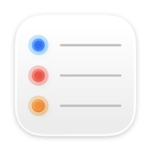
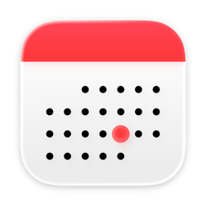

# Apple Apps MCP Plugins for Codex

Use Apple Mail, Apple Reminders, and Apple Calendar from local Codex plugins on
macOS.

This repository contains three repo-local Codex plugins:

- `apple-mail`
- `apple-reminders`
- `apple-calendar`

Each plugin exposes one MCP server and one Apple app surface. The TypeScript
service code is shared in `src/`, while each plugin has its own manifest,
skill, icon, MCP config, and bundled server in `plugins/<plugin>/dist`.

<p align="center">
  
  &nbsp;&nbsp;&nbsp;
  
  &nbsp;&nbsp;&nbsp;
  
</p>

<p align="center"><strong>Mail</strong> · <strong>Reminders</strong> · <strong>Calendar</strong></p>

## Features

- Search, read, draft, send, archive, delete-to-trash, junk, and move Apple Mail
  messages.
- List reminder lists, search/read reminders, and create/update/complete/delete
  or move reminders.
- List calendars, search/read/show events, and create/update/delete Calendar
  events.
- Per-plugin write guard for mutating operations, with ask mode by default.
- Live, ephemeral reads. The plugins do not build or store persistent local
  mail, calendar, or reminders indexes.

## Requirements

- macOS with Apple Mail, Calendar, and Reminders available.
- Node.js and npm.
- Xcode Command Line Tools, including `xcrun`, Swift, and `codesign`.
- Local app permissions granted when macOS prompts for Apple Events, Calendar,
  or Reminders access.

## Quick Start

Clone and build the repository:

```bash
git clone <repo-url>
cd codex-apple-plugin
npm install
npm run build
npm run permissions:request
```

`npm run permissions:request` builds the three plugins, runs metadata-only
AppleScript probes to trigger OS permission prompts, then verifies native access.
It prints counts/status only, not mail bodies, calendar notes, or reminder
notes.

To load the plugins in Codex, use the bundled marketplace entry at
[`.agents/plugins/marketplace.json`](.agents/plugins/marketplace.json). It
points Codex at:

- [`plugins/apple-mail`](plugins/apple-mail)
- [`plugins/apple-reminders`](plugins/apple-reminders)
- [`plugins/apple-calendar`](plugins/apple-calendar)

For manual MCP client setup, point the client at the desired bundled server:

```json
{
  "mcpServers": {
    "apple-mail": {
      "command": "node",
      "args": ["/absolute/path/to/codex-apple-plugin/plugins/apple-mail/dist/index.mjs"],
      "env": {
        "APPLE_MAIL_WRITE_MODE": "ask"
      }
    }
  }
}
```

The other servers are:

- `plugins/apple-reminders/dist/index.mjs`
- `plugins/apple-calendar/dist/index.mjs`

## Permission Model

Each plugin has a setup tool:

- `mail_request_permissions`
- `reminders_request_permissions`
- `calendar_request_permissions`

The setup flow first uses AppleScript for a minimal metadata probe, then runs the
native implementation's permission/access probe. This is intentionally a
permission trigger and proof step, not an AppleScript replacement backend.

The AppleScript probes only count accounts/mailboxes, reminder lists, or
calendars. They do not read message bodies, event notes, or reminder notes.

Calendar and Reminders native access are built as direct command-line helpers.
Calendar setup intentionally does not run a native EventKit probe. After the
AppleScript permission prompt is accepted, explicitly open System Settings >
Privacy & Security > Calendars and enable Full Access for Codex or the
`apple-calendar` helper entry shown by macOS before using Calendar tools.

## Safety Model

Writes are controlled per plugin:

| Plugin | Variable | Values |
| --- | --- | --- |
| Apple Mail | `APPLE_MAIL_WRITE_MODE` | `ask` or `direct` |
| Apple Reminders | `APPLE_REMINDERS_WRITE_MODE` | `ask` or `direct` |
| Apple Calendar | `APPLE_CALENDAR_WRITE_MODE` | `ask` or `direct` |

The old shared `APPLE_PRODUCTIVITY_WRITE_MODE` remains a fallback.

In ask mode, mutating tools do not write unless the request includes
`confirm: true`. Without confirmation they return a preview or target summary
plus `allowed: false`.

Every guarded write tool also accepts `dryRun: true`, which never writes even in
direct mode.

Important delete semantics:

- Mail delete means move to the account Trash or Deleted mailbox. It does not
  permanently expunge mail.
- Calendar delete removes the selected event or excludes a recurring
  occurrence.
- Reminder delete is a real Reminders deletion.

`mail_compose` is intentionally outside the write guard because it only opens a
visible compose window or creates a draft.

## Configuration

| Variable | Default | Description |
| --- | --- | --- |
| `APPLE_MAIL_WRITE_MODE` | `ask` | Mail write mode. |
| `APPLE_REMINDERS_WRITE_MODE` | `ask` | Reminders write mode. |
| `APPLE_CALENDAR_WRITE_MODE` | `ask` | Calendar write mode. |
| `APPLE_MAIL_MAX_BODY_CHARS` | `12000` | Maximum Mail body characters returned by read-style tools. |
| `APPLE_REMINDERS_MAX_BODY_CHARS` | `12000` | Maximum Reminders notes characters returned by read-style tools. |
| `APPLE_CALENDAR_MAX_BODY_CHARS` | `12000` | Maximum Calendar notes characters returned by read-style tools. |
| `APPLE_PRODUCTIVITY_RETRIEVAL_CANDIDATE_LIMIT` | `30` | Default Mail retrieval candidate count. |
| `APPLE_PRODUCTIVITY_CONTEXT_TOP_K` | `5` | Default Mail retrieval snippet count. |
| `APPLE_PRODUCTIVITY_HELPER_TIMEOUT_MS` | `60000` | Native helper and AppleScript timeout in milliseconds. |
| `APPLE_REMINDERS_DEFAULT_LIST` | unset | Optional default Reminders list name or identifier. |

The old `APPLE_PRODUCTIVITY_MAX_BODY_CHARS` and
`APPLE_PRODUCTIVITY_DEFAULT_REMINDERS_LIST` remain fallbacks.

## Tools

### Mail

- `mail_request_permissions`
- `mail_list_accounts`
- `mail_list_mailboxes`
- `mail_search`
- `mail_retrieve_context`
- `mail_read`
- `mail_compose`
- `mail_send`
- `mail_move`
- `mail_undo_move`
- `mail_archive`
- `mail_delete`
- `mail_junk`

### Reminders

- `reminders_request_permissions`
- `reminders_list_lists`
- `reminders_search`
- `reminders_read`
- `reminders_create`
- `reminders_update`
- `reminders_complete`
- `reminders_delete`
- `reminders_move`

### Calendar

- `calendar_request_permissions`
- `calendar_list_calendars`
- `calendar_search_events`
- `calendar_read_event`
- `calendar_create_event`
- `calendar_update_event`
- `calendar_delete_event`
- `calendar_show_event`

## Privacy

All servers run locally and read from local Apple apps. They do not persist mail
bodies, calendar notes, reminder notes, or search indexes.

MCP clients can still display or log tool output. Keep read limits conservative
and avoid sharing generated logs when they may contain personal content.
